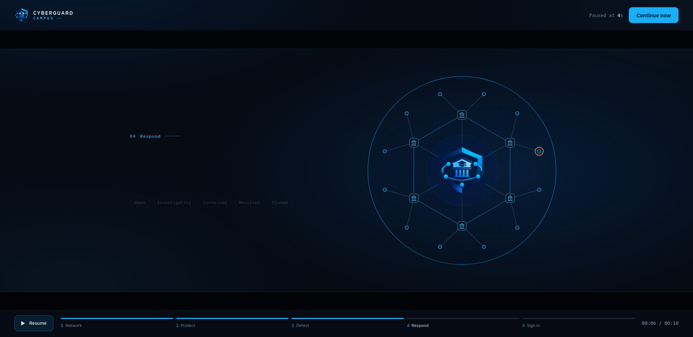
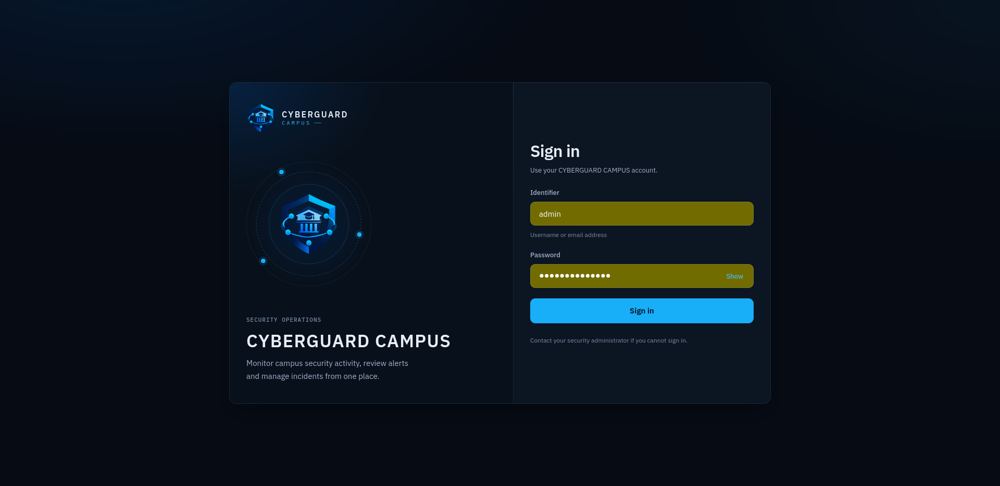
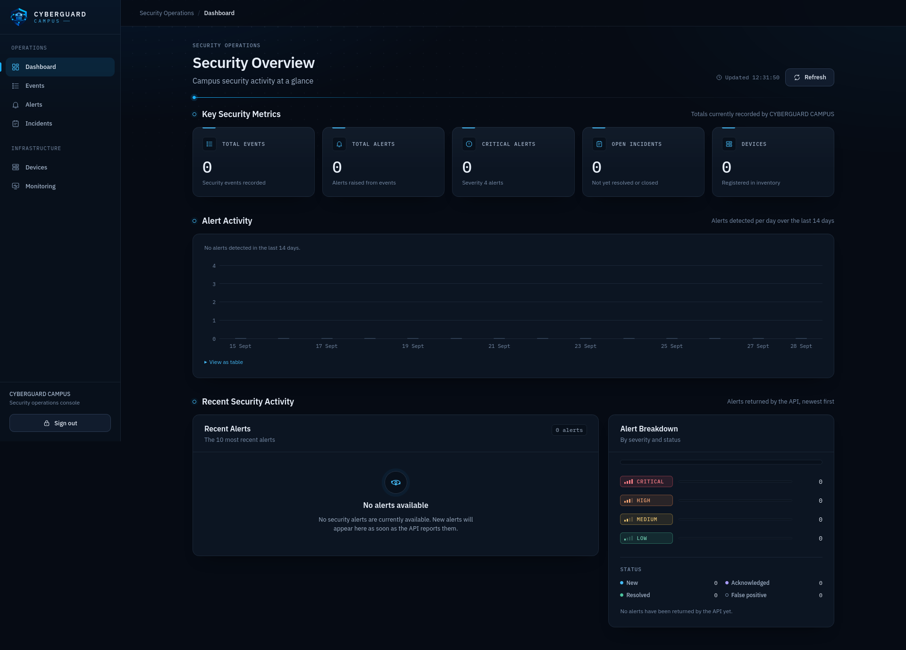
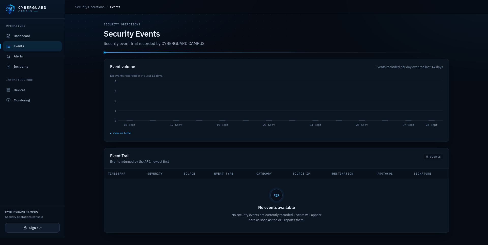
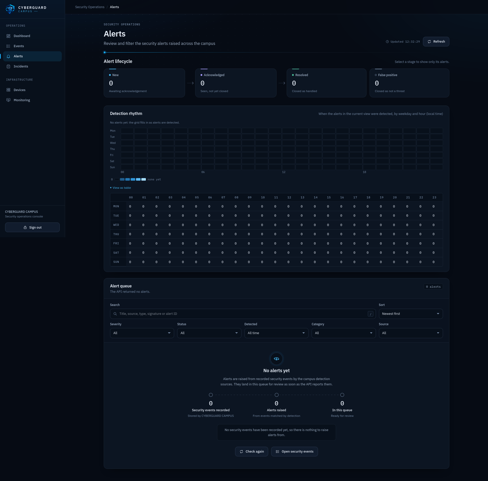
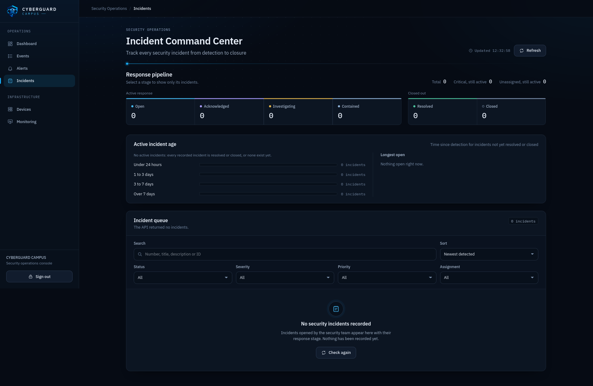
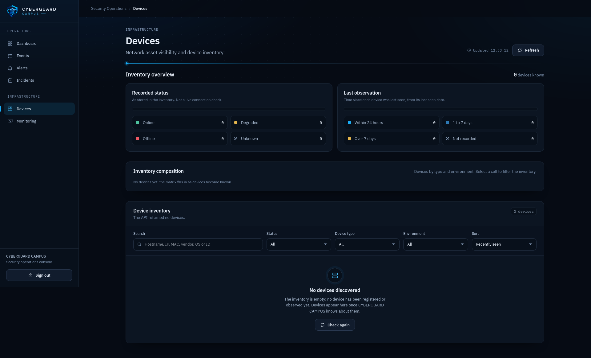
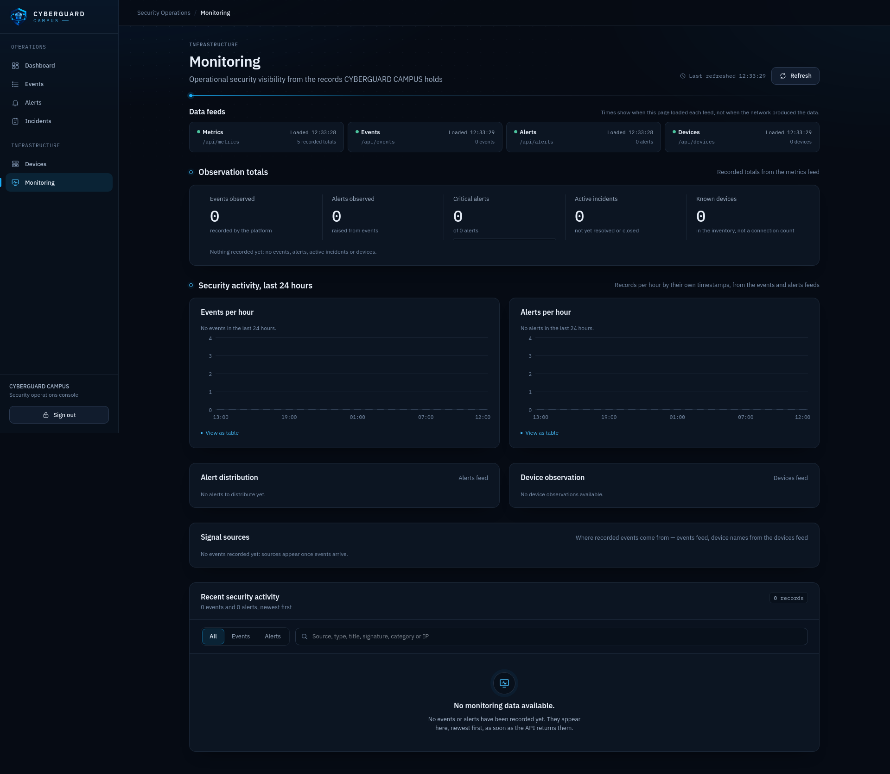
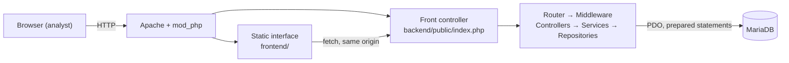

<p align="center">
  
</p>

<h1 align="center">CYBERGUARD CAMPUS</h1>

<p align="center">
  Security monitoring and incident management for an IP network.<br>
  PHP&nbsp;8.2 · MariaDB&nbsp;11.8 · REST API · vanilla&nbsp;ES&nbsp;modules · no framework, one dependency.
</p>

---

CYBERGUARD CAMPUS gives a small security team one place to read what the network reported —
events, alerts, devices — and to drive incidents through a lifecycle that the server enforces,
with a full history and an audit trail.

**What it does today:** stores and serves security records, runs the incident lifecycle, and
protects sign-in with a hardened authentication chain.
**What it does not do yet:** collect anything by itself. Records reach the database through SQL;
sensors, IDS/firewall ingestion and correlation are planned. See the
[roadmap](doc/01-overview/roadmap.md).

## Screenshots

| Welcome | Sign in |
|---|---|
|  |  |

**Security Overview** — counters and alert activity over the last 14 days



| Security Events | Alerts |
|---|---|
|  |  |

| Incidents | Devices |
|---|---|
|  |  |

**Monitoring** — counts per day, per hour and per environment, derived from API data only



## Features

| Area | Detail |
|---|---|
| **Incidents** | Server-side state machine (`open → acknowledged → investigating → contained → resolved → closed`), one step at a time, closing reserved to administrators, lifecycle timestamps and a full history |
| **Read API** | Incidents, events, alerts, devices and summary metrics |
| **Authentication** | Sessions with a 6-hour absolute lifetime, regeneration at sign-in, server-side sign-out, revocation as soon as an account is disabled, locked or deleted |
| **Sign-in hardening** | Progressive throttling, equalised timing (one bcrypt verification per failure), CSRF protection, input bounds, no secret in traces, `Cache-Control: no-store` |
| **Access control** | Roles `viewer`, `analyst`, `admin`, re-read from the database on every request |
| **Audit trail** | Authentication events in `audit_logs`; incident changes in `incident_history` |
| **Interface** | 8 pages, charts built without any library, each with a table twin, responsive and keyboard-accessible |
| **Tests** | 21 suites, 648 checks, including concurrency and security suites that fail if a control is removed |

## Architecture



Layering is strict: a controller does HTTP, a service holds the rules, a repository writes SQL.
Wiring is explicit in `backend/public/index.php` — no container, no magic.

| Layer | Technology |
|---|---|
| Web server | Apache 2.4 with `mod_php` |
| Backend | PHP 8.2, PSR-4, one Composer dependency (`vlucas/phpdotenv`) |
| Database | MariaDB 11.8, 8 tables, 8 SQL migrations |
| Frontend | HTML + ES modules + CSS, no build step, no dependency |

## Quick start

```bash
# 1. Place the project inside the Apache document root
cd /opt/lampp/htdocs
git clone git@github.com:Mugisho-dev-metasploit/cyberguard-campus.git
cd cyberguard-campus

# 2. Configure
cp .env.example .env        # fill DB_HOST, DB_PORT, DB_DATABASE, DB_USERNAME, DB_PASSWORD

# 3. Install the backend dependency
cd backend && composer install && cd ..

# 4. Create the schema (migrations are applied one by one, in order)
for f in backend/database/migrations/0*.sql; do
  /opt/lampp/bin/php -r '
    require "backend/vendor/autoload.php";
    CyberGuard\Campus\Bootstrap\Environment::load(getcwd());
    CyberGuard\Campus\Database\Database::connection()->exec(file_get_contents($argv[1]));' "$f"
done

# 5. Create your first account (no interface exists for this yet)
/opt/lampp/bin/php -r 'echo password_hash(readline("password: "), PASSWORD_BCRYPT, ["cost" => 12]), PHP_EOL;'
# then INSERT it into users with role 'admin' and status 'active'

# 6. Start and check
sudo /opt/lampp/lampp start
curl -s http://localhost/cyberguard-campus/backend/public/index.php/health
```

Interface: `http://localhost/cyberguard-campus/frontend/welcome.html`
Full procedure: [doc/10-deployment/development.md](doc/10-deployment/development.md).

## API

| Method | Path | Auth | Roles |
|---|---|---|---|
| GET | `/health` | — | — |
| POST | `/login` | — | — |
| POST | `/logout` | — | — |
| GET | `/api/incidents` | session | viewer, analyst, admin |
| GET | `/api/incidents/{id}` | session | viewer, analyst, admin |
| PATCH | `/api/incidents/{id}` | session | analyst, admin (`closed`: admin) |
| GET | `/api/events` · `/api/alerts` · `/api/devices` · `/api/metrics` | session | viewer, analyst, admin |

`POST /login` requires `Content-Type: application/json`. Reference and examples:
[doc/08-api/endpoints.md](doc/08-api/endpoints.md).

## Security

Authentication has been hardened ticket by ticket, each finding audited, fixed and covered by a
test that fails on the vulnerable code: brute force, timing-based account enumeration, secrets
in exception traces, oversized input, session establishment failures, response caching, login
CSRF, password-hash policy, HTTP surface and the audit trail.

Details: [doc/06-security/security-overview.md](doc/06-security/security-overview.md) ·
threat model: [doc/06-security/threat-model.md](doc/06-security/threat-model.md).

**Known limits of the current deployment**: it runs over plain HTTP in the laboratory (HTTPS and
the `Secure` cookie are ready in the code but not deployed), sessions share the host's session
directory with other applications, and there is no backup. Each is documented with what it would
take to close it.

## Tests

```bash
/opt/lampp/bin/php backend/tests/run.php          # every suite (Apache and MariaDB must be running)
/opt/lampp/bin/php backend/tests/LoginCsrfTest.php # one suite
```

Suites create their own data, delete it, and fail if the database is not identical before and
after. They refuse to run when `APP_ENV=production`. See
[doc/11-testing/testing-strategy.md](doc/11-testing/testing-strategy.md).

## Repository structure

```text
backend/        API: front controller, router, middleware, controllers, services,
                repositories, models, SQL migrations, test suites
frontend/       Web interface: 8 pages, ES modules, CSS, fonts, images
doc/            Documentation (16 sections) — start at doc/README.md
docs/security/  Authentication hardening status and production requirements
infrastructure/ Placeholders for future integrations (empty)
scripts/        Empty
tests/          Empty (the test suites live in backend/tests)
```

## Documentation

Everything is documented in [`doc/`](doc/README.md), with an explicit status on each feature
(`IMPLEMENTED`, `PARTIAL`, `PLANNED`, `PROPOSED`, `UNKNOWN`):

| Topic | Entry point |
|---|---|
| Product, roles, use cases | [doc/02-product](doc/02-product/product-overview.md) |
| Architecture and flows | [doc/03-architecture](doc/03-architecture/system-architecture.md) |
| Backend | [doc/04-backend](doc/04-backend/backend-overview.md) |
| Frontend | [doc/05-frontend](doc/05-frontend/frontend-overview.md) |
| Security | [doc/06-security](doc/06-security/security-overview.md) |
| Network monitoring (what exists, what does not) | [doc/07-network-monitoring](doc/07-network-monitoring/monitoring-overview.md) |
| API | [doc/08-api](doc/08-api/api-overview.md) |
| Database | [doc/09-database](doc/09-database/schema.md) |
| Deployment | [doc/10-deployment](doc/10-deployment/development.md) |
| Testing | [doc/11-testing](doc/11-testing/testing-strategy.md) |
| Operations | [doc/12-operations](doc/12-operations/operations.md) |
| Development | [doc/13-development](doc/13-development/setup.md) |
| Reference (glossary, variables, commands, ports) | [doc/16-reference](doc/16-reference/glossary.md) |

## Development rule

All components must be tested, documented, versioned and integrated.

## Author

Mugisho-dev-metasploit — [github.com/Mugisho-dev-metasploit/cyberguard-campus](https://github.com/Mugisho-dev-metasploit/cyberguard-campus)

No licence file is present in the repository yet.
