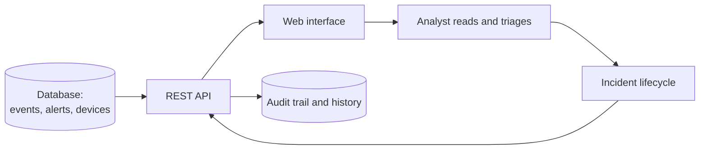

# Product overview

CYBERGUARD CAMPUS gives a small security team one place to look at what the network reported and
to run incidents to closure.

## The loop it supports today

Records arrive in the database by SQL today; see
[07-network-monitoring/monitoring-overview.md](../07-network-monitoring/monitoring-overview.md).

## What a user gets

| Capability | Detail | Status |
|---|---|---|
| Sign in / sign out | Session cookie, 6-hour absolute lifetime | `IMPLEMENTED` |
| Dashboard | Counters (events, alerts, critical alerts, open incidents, devices) and alert activity | `IMPLEMENTED` |
| Events | Table of security events with their network fields | `IMPLEMENTED` |
| Alerts | Table with severity, status and lifecycle timestamps | `IMPLEMENTED` |
| Incidents | List, detail, history, and the actions allowed by the role | `IMPLEMENTED` |
| Devices | Inventory with recorded status and last observation | `IMPLEMENTED` |
| Monitoring | Derived views (per day, per hour, per environment) computed in the browser from API data | `IMPLEMENTED` |
| Create or edit events, alerts or devices | Not available anywhere | `PLANNED` |
| Manage users | Not available anywhere | `PLANNED` |
| Export or report | Not available | `PLANNED` |

## What it is not

Not a detection engine, not a log collector, not a firewall console. It is the case-management
and visualisation half of a SOC toolchain, with a hardened authentication layer.

See [features.md](features.md) for the feature-by-feature status and
[use-cases.md](use-cases.md) for the flows an analyst can actually complete.
