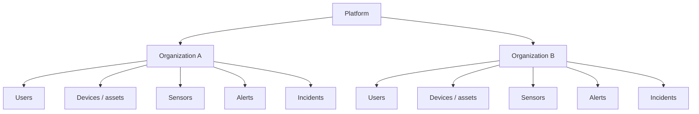

# SaaS / multi-tenant model

**Status: `PLANNED`. Nothing in the repository implements tenancy.**

## What the code shows today

- No `organizations`, `tenants` or `customers` table: the schema has `users`, `devices`,
  `events`, `alerts`, `incidents`, `incident_history`, `audit_logs`, `login_throttle`.
- No tenant column on any table, and no tenant filter in any repository query: every read
  endpoint returns every row of its table.
- One database, one `.env`, one Apache virtual host: one installation serves one organisation.

The application is therefore **single-tenant** as it stands. Deploying it for two organisations
today means two installations (separate databases and separate document roots).

## Target shape (`PROPOSED`)

## What it would take

| Step | Work |
|---|---|
| Data model | An `organizations` table, and an organization key on every business table |
| Access control | Bind the session to one organization and filter every query by it; the current role check is not enough |
| Isolation tests | Prove that a user of A can never read or write a record of B (the pattern used by `AuthorizationApiTest` applies) |
| Onboarding | Create an organization, its first administrator, its devices |
| Operations | Per-tenant retention, quotas and backups |
| Billing | Nothing exists; would be external |

Until those exist, describe the product as single-tenant. See
[15-business/business-model.md](../15-business/business-model.md) for the commercial framing.
