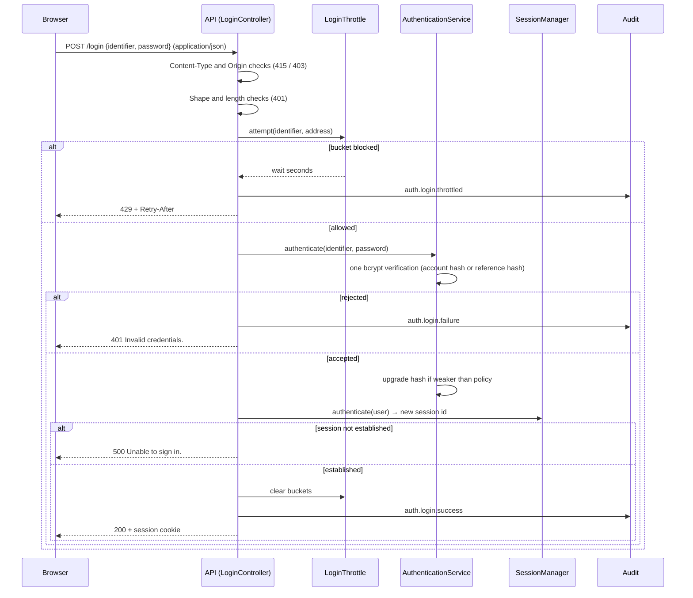
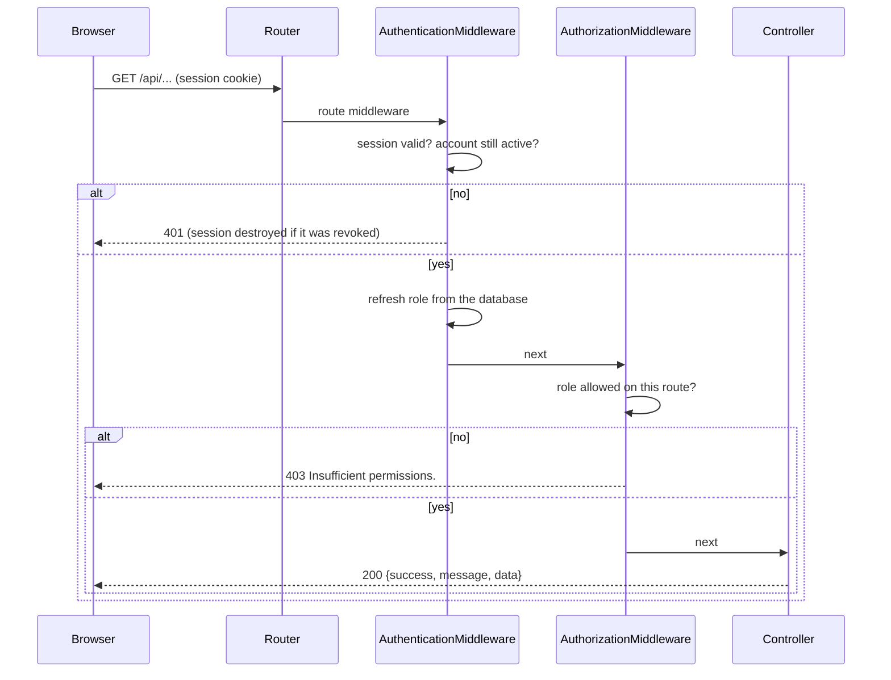

# Workflows

## Sign-in

## Protected request

## Incident lifecycle

See [03-architecture/incident-flow.md](../03-architecture/incident-flow.md) for the state
machine and the write sequence.

## Sign-out

`POST /logout` destroys the session server-side, expires the cookie and answers the same
generic 200 whether or not a session existed. See
[06-security/authentication-security.md](../06-security/authentication-security.md).
