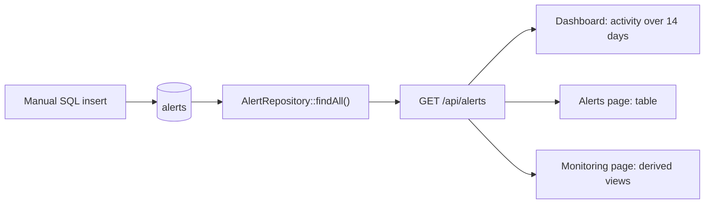
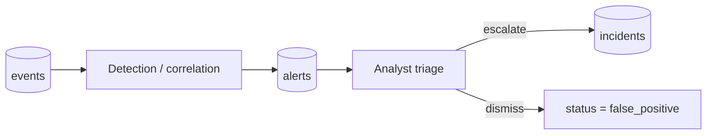

# Alert flow

## Today

An alert holds `source`, `alert_type`, `severity` (1–4), `title`, `description`, `signature`,
`category`, `status` (`new`, `acknowledged`, `resolved`, `false_positive`), `detected_at`,
`acknowledged_at`, `resolved_at`, an optional `event_id`, `device_id` and `assigned_to`.

## What the application does with alerts

| Action | Status |
|---|---|
| Read them (list, dashboard, monitoring) | `IMPLEMENTED` |
| Change an alert status (acknowledge, resolve, mark false positive) | `PLANNED` — no write endpoint |
| Raise an incident from an alert | `PLANNED` — `incidents.alert_id` exists, nothing fills it through the API |
| Notify anyone | `PLANNED` |

The alert lifecycle columns exist in the schema but no code writes them: only manual SQL can.

## Intended flow (`PLANNED`)

