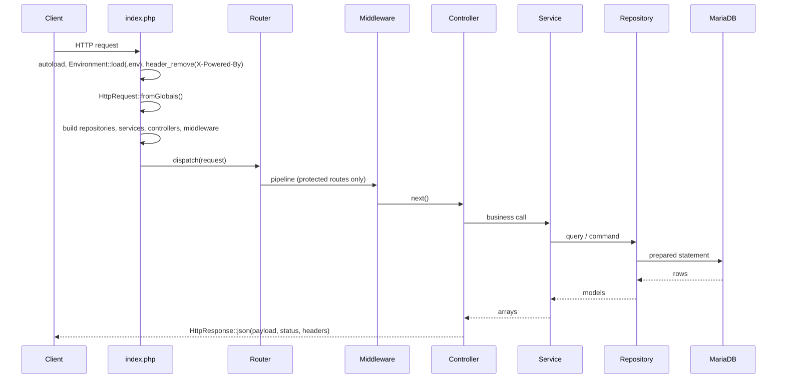

# Application architecture

## Request lifecycle

Wiring is explicit in `backend/public/index.php`: no container, no service locator, no
reflection. Every dependency is passed to a constructor.

## Classes by layer

| Layer | Classes |
|---|---|
| Bootstrap | `Environment` |
| Core | `Application`, `HttpRequest`, `HttpResponse`, `SessionManager` |
| Routing | `Router` |
| Middleware | `AuthenticationMiddleware`, `AuthorizationMiddleware` |
| Controllers | `LoginController`, `IncidentController`, `EventController`, `AlertController`, `DeviceController`, `MetricsController` |
| Services | `AuthenticationService`, `AuthenticationResult`, `AuthenticationAudit`, `LoginThrottle`, `IncidentService`, `EventService`, `AlertService`, `DeviceService`, `MetricsService` |
| Repositories | `UserRepository`, `IncidentRepository`, `EventRepository`, `AlertRepository`, `DeviceRepository`, `MetricsRepository`, `AuditLogRepository`, `LoginThrottleRepository` |
| Models | `User`, `Incident`, `Event`, `Alert`, `Device` |
| Exceptions | `AuthenticationException`, `AuthorizationException` |
| Database | `Database` |

`Core/Application.php` only returns the product name; it is not a kernel.

## Conventions

- `declare(strict_types=1)` in every file; PSR-4 under `CyberGuard\Campus\`.
- Constructor property promotion, `private readonly` dependencies, `final class`.
- Every response goes through `HttpResponse::json()`: `{success, message}` plus `data` on reads.
- Controllers catch `Throwable` and answer a generic 500; they never leak internals.
- Sensitive parameters (`$password`, `$identifier`, hashes) carry `#[\SensitiveParameter]`.

## Extension points

| To add | Touch |
|---|---|
| A route | `backend/public/index.php` (route table + wiring) |
| A read endpoint | Controller + Service + Repository + model |
| A rule on incidents | `IncidentService` constants and validation |
| A new authentication control | `LoginController` (transport), `AuthenticationService` (credentials), `SessionManager` (session) |
