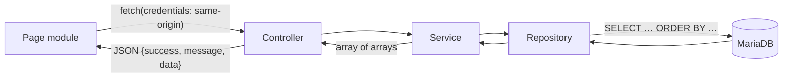

# Data flow

## Read path (all list endpoints)

Characteristics, true for `/api/events`, `/api/alerts`, `/api/devices`, `/api/incidents`:

- **No pagination, no filter, no sort parameter**: the repository selects the whole table with a
  fixed `ORDER BY` (`detected_at DESC`, `event_timestamp DESC`, `last_seen_at DESC`). This is a
  known limitation, listed in [01-overview/roadmap.md](../01-overview/roadmap.md).
- Models expose only the columns the interface needs; `password_hash` never leaves
  `UserRepository`.
- `/api/metrics` runs one statement with five scalar sub-queries.

## Write path (the only one)

`PATCH /api/incidents/{id}` — see [incident-flow.md](incident-flow.md) for the sequence, the
transaction and the row lock.

## Data entering the system

| Data | How it arrives today | Status |
|---|---|---|
| Users | SQL insert by an administrator | `PARTIAL` (no interface) |
| Devices, events, alerts | SQL insert | `PLANNED` (no ingestion) |
| Incidents | SQL insert; only updates go through the API | `PARTIAL` |
| Incident history | Written by the API on every accepted change | `IMPLEMENTED` |
| Audit logs | Written by the API on authentication events | `IMPLEMENTED` |
| Throttle buckets | Written by the API on sign-in attempts | `IMPLEMENTED` |

## Data leaving the system

Only HTTP JSON responses to an authenticated browser. No export, no webhook, no outbound
connection of any kind (`PLANNED`).

## Sensitive data in transit

| Data | Where it travels | Protection |
|---|---|---|
| Password | Browser → `POST /login` body | HTTPS `PLANNED`; never logged, never stored in clear |
| Session id | `Set-Cookie` / `Cookie` header | `HttpOnly`, `SameSite=Lax`, `Secure` in production |
| Business records | API responses | Session-bound; `Cache-Control: no-store` on authentication responses |
