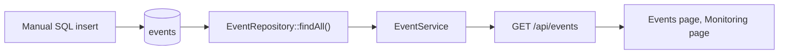

# Event flow

## Today

An event carries what a network sensor would provide: `source`, `event_type`, `severity`,
`event_timestamp`, `src_ip`/`src_port`, `dst_ip`/`dst_port`, `protocol`, `signature`,
`category`, `raw_data` and optional `normalized_data`, plus an optional link to a device.

The schema is therefore ready for ingestion; the ingestion itself does not exist.

## Missing pieces (`PLANNED`)

| Piece | What it would do |
|---|---|
| Collector or agent | Read from Suricata EVE JSON, syslog, firewall logs |
| Ingestion endpoint | Authenticated write path with strict validation and rate limits |
| Normalisation | Fill `normalized_data` and map sources to a common vocabulary |
| Deduplication | Avoid storing the same event twice |
| Detection | Turn events into alerts (`alerts.event_id` already exists for that link) |
| Retention | Delete or archive old events; nothing does today |

## What ingestion would have to respect

- The same layering: controller → service → repository.
- Prepared statements only, with bounded input (the sign-in path shows the pattern: explicit
  maximum lengths, rejection rather than truncation).
- Its own authentication (a sensor is not a browser session): an API credential model would be
  needed, and none exists.
