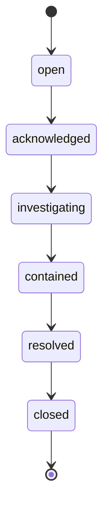
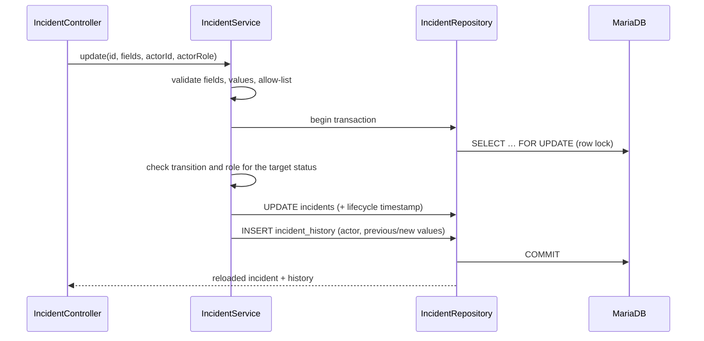

# Incident flow

The only write path in the API, and the most constrained part of the application.

## State machine (`IMPLEMENTED`)

Rules enforced in `IncidentService`:

- One step at a time, in this order; any other target status is refused with 422.
- The current status always comes from the stored row, never from the client.
- `closed` is final.
- Asking for the status the incident already has is a no-op, not a transition.
- Only `admin` may set `closed`; `analyst` and `admin` may perform the other transitions
  (`viewer` cannot PATCH at all — that is the route's authorization).

## Fields accepted by `PATCH /api/incidents/{id}`

`title`, `description`, `severity` (1–4), `status`, `priority` (`low`, `medium`, `high`,
`critical`), `assigned_to` (existing user id or null), `resolution`. Anything else is refused
with 422 and the message names the unknown fields.

## Write sequence

- The row lock makes two concurrent transitions safe: the second one sees the new status and is
  refused if it no longer applies (covered by `IncidentConcurrencyTest`).
- Any failure rolls the transaction back: no partial update, no orphan history row.
- Lifecycle timestamps (`acknowledged_at`, `contained_at`, `resolved_at`, `closed_at`) are set
  by the database when the incident enters the matching status.

## History

Every accepted change writes a row in `incident_history`: `incident_id`, `user_id` (the actor
from the session), `action`, `previous_status`, `new_status`, `previous_assignee`,
`new_assignee`, `comment`, `created_at`. The detail endpoint returns it oldest first.

## Not implemented

Creating an incident, deleting one, reopening a closed one, attaching evidence, or commenting
without a status change (`PLANNED`).
