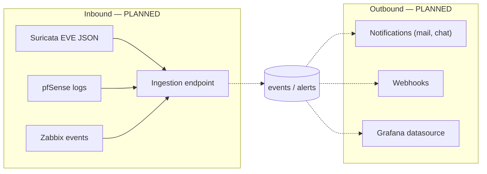

# Integration architecture

**Status: `PLANNED`. The application has no integration with any external system.**

## Verified facts

- No HTTP client, no cURL call, no socket, no mail function anywhere in `backend/src`.
- No queue, no broker, no scheduler, no cron entry in the repository.
- No webhook endpoint, inbound or outbound.
- `infrastructure/` holds empty directories for `eve-ng`, `grafana`, `pfsense`, `siem`,
  `suricata` and `zabbix`.
- The only external dependency is `vlucas/phpdotenv`, used to read `.env`.

## Where integrations would attach

## Prerequisites before any integration

| Need | Why |
|---|---|
| Machine authentication | Sessions are browser-bound; a sensor needs its own credential model (none exists) |
| Write endpoints | There is no way to create events or alerts through the API |
| Input bounds and rate limits on writes | The sign-in path shows the expected pattern |
| Idempotency | Repeated deliveries must not duplicate records |
| Outbound egress rules | The application currently opens no outbound connection |

Anything describing a working Suricata, pfSense, Zabbix, Grafana or n8n integration would be
invention; see [07-network-monitoring](../07-network-monitoring/monitoring-overview.md) for the
per-tool status.
