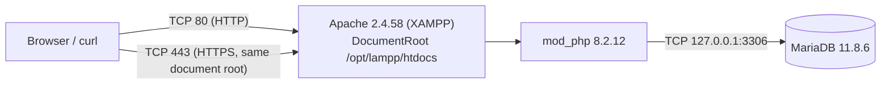
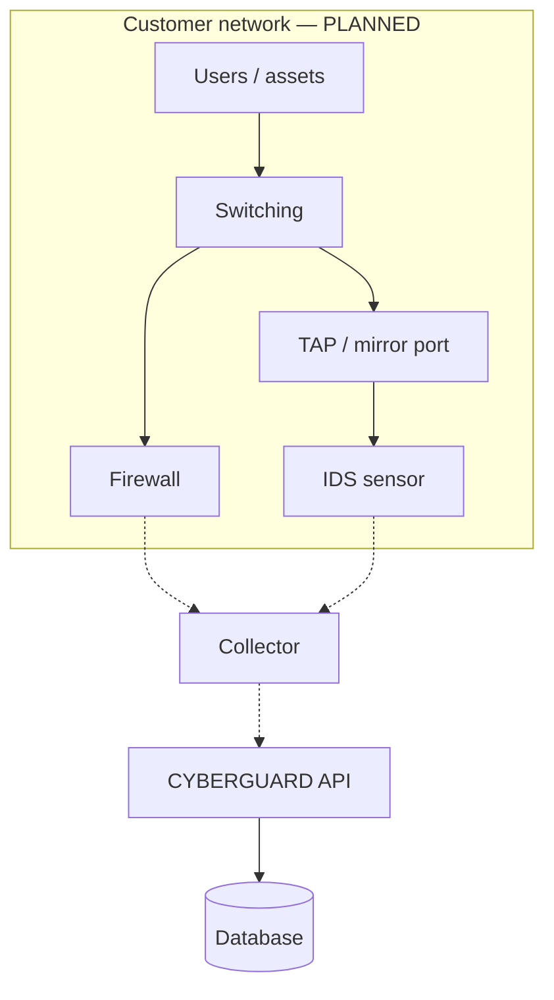

# Network architecture

## Observed deployment (development laboratory)

| Property | Value | Source |
|---|---|---|
| HTTP listener | `*:80` | `httpd.conf` |
| HTTPS listener | `*:443`, same document root | XAMPP SSL virtual host |
| Database listener | `127.0.0.1:3306` only | MariaDB configuration |
| Application URL | `http://<host>/cyberguard-campus/frontend/…` and `…/backend/public/index.php/…` | `.htaccess`, `frontend/assets/js/api.js` |
| TLS in use | No; the laboratory runs over plain HTTP | See [06-security/network-security.md](../06-security/network-security.md) |

Other applications share the same Apache document root; the project protects itself with its own
`.htaccess` rules rather than with a dedicated virtual host.

## Segmentation

The repository contains no network design: `infrastructure/` is a set of empty directories. Any
description of VLANs, span ports, sensor placement or firewall rules would be invention. What
the application needs is modest and can be stated:

| Flow | Direction | Port | Status |
|---|---|---|---|
| Analyst → application | inbound | 443 (should be), 80 (today) | `IMPLEMENTED` (HTTP), HTTPS `PLANNED` |
| Application → database | loopback | 3306 | `IMPLEMENTED` |
| Sensors → application | inbound | none defined | `PLANNED` |
| Application → notification services | outbound | none | `PLANNED` |

## Target topology (`PROPOSED`)

Everything in this second diagram is `PLANNED`; see
[07-network-monitoring/network-topology.md](../07-network-monitoring/network-topology.md).
