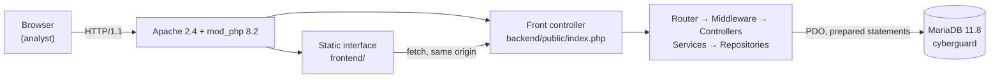
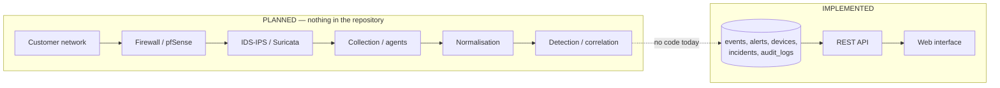

# System architecture

## What runs today

Everything runs on one host. Apache serves the static interface and the single PHP entry point;
PHP talks to MariaDB on `127.0.0.1:3306`. There is no queue, no cache, no external service.

## Intended pipeline, with today's boundary

The dotted arrow is the gap: records reach the database by SQL only.

## Layers

| Layer | Responsibility | Code |
|---|---|---|
| Transport | TLS (absent in the laboratory), routing of `/backend/public/index.php/...` | Apache, `.htaccess` |
| Entry point | Autoload, environment, dependency wiring, route table | `backend/public/index.php` |
| Routing | Method + path match, middleware pipeline, 404/405 | `Routing/Router.php` |
| Middleware | Authentication (session + account), authorization (role) | `Middleware/` |
| Controllers | HTTP shape: read input, choose status code, emit JSON | `Controllers/` |
| Services | Business rules: authentication, throttling, audit, incident state machine | `Services/` |
| Repositories | SQL, always prepared statements, mapping to models | `Repositories/` |
| Models | Read-only value objects | `Models/` |
| Storage | InnoDB tables with foreign keys and check constraints | `backend/database/migrations` |

Dependencies point downwards only; no repository calls a service, no service emits HTTP.

## Properties worth knowing

- **Stateless except for sessions**: session state lives in PHP session files, everything else
  in MariaDB. Horizontal scaling would need shared session storage — see
  [scalability.md](scalability.md).
- **One connection per request**, created in `Database::connection()` and reused in-process.
- **No background worker**: everything happens inside the request.
- **No cache layer**: every read hits the database.
