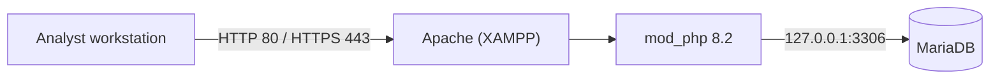

# Network topology

**Status: `UNKNOWN` for the target network, `IMPLEMENTED` for the application's own footprint.**

The repository contains no topology: no diagram, no address plan, no VLAN list, no EVE-NG lab
file (`infrastructure/eve-ng/{configs,labs}` are empty). Describing a campus topology here
would be invention.

## What is known

The application's own footprint, observed on the host:

- Apache listens on all interfaces; MariaDB listens on loopback only.
- The application makes no outbound connection.

## What a deployment would need to document

| Item | Why it matters |
|---|---|
| Where the application sits (segment, reachability) | It holds security records for the whole network |
| Which segments are monitored, and how traffic reaches a sensor (TAP, mirror port) | Determines coverage |
| Address plan for devices recorded in the inventory | `devices.ip_address` is free text today |
| Flows allowed towards the application | Sensors would need a path; none is defined |

Until a real deployment exists, this file stays a template rather than a description.
