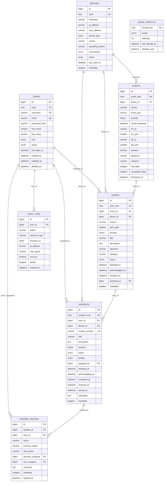

# Database schema

Engine: **MariaDB 11.8.6**, InnoDB, `utf8mb4` / `utf8mb4_unicode_ci`, database `cyberguard`.
Eight tables, created by the eight files in `backend/database/migrations`.

## Conventions

- Primary keys: `BIGINT UNSIGNED AUTO_INCREMENT`, except `login_throttle` (a `CHAR(64)` digest).
- Public identifiers: `CHAR(36)` UUIDs, unique, on users, devices, events, alerts, incidents.
- Timestamps: `DATETIME(6)` (microseconds), `created_at` defaulted, `updated_at` with
  `ON UPDATE CURRENT_TIMESTAMP(6)` where present.
- Soft delete: only `users.deleted_at`; every other table is hard-deleted.
- JSON payloads (`metadata`, `details`, `normalized_data`, `raw_data`) are stored as `LONGTEXT`
  (declared `JSON` in the migrations; MariaDB maps that to `LONGTEXT` with a check constraint).

Column-by-column detail: [entities.md](entities.md). Relationships and delete rules:
[relationships.md](relationships.md).
